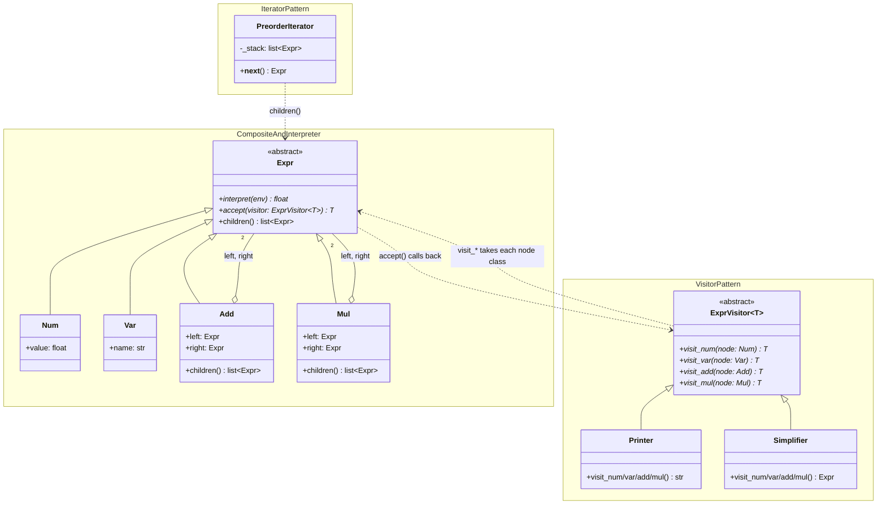
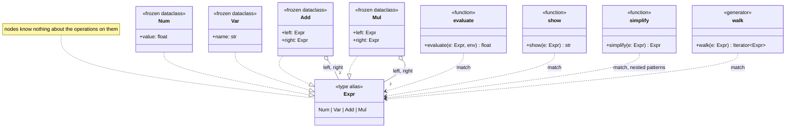
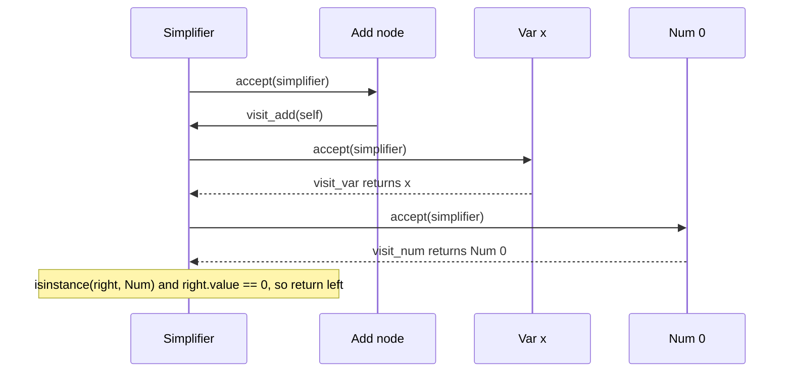
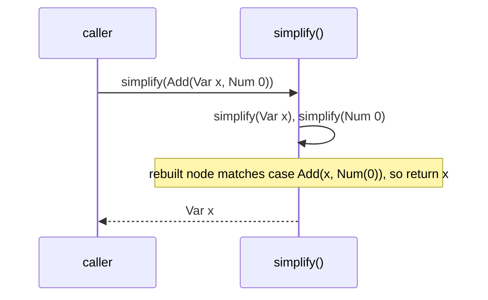

# Expression tree: architecture

UML for both shapes of the toy. In the classic shape the node classes are busy. Each one
evaluates itself (Interpreter), dispatches visitors (Visitor), and reports its children
(Composite, used by Iterator). In the modern shape the nodes are plain data, and every
operation is a function outside them.

## Participants

| Pattern | GoF participant | `classic.py` | `modern.py` |
|---|---|---|---|
| Composite | Component | `Expr` (ABC) | `Expr`, a union type alias |
| | Leaf | `Num`, `Var` | `Num`, `Var` (frozen dataclasses) |
| | Composite | `Add`, `Mul`, which override `children()` | `Add`, `Mul`, whose fields are `Expr` |
| Interpreter | AbstractExpression | `Expr.interpret(env)` | `evaluate(e, env)` |
| | TerminalExpression | `Num`, `Var` | `case Num(...)`, `case Var(...)` |
| | NonterminalExpression | `Add`, `Mul` | `case Add(...)`, `case Mul(...)` |
| | Context | `env: Mapping[str, float]` | `env: Mapping[str, float]` |
| Visitor | Visitor | `ExprVisitor[T]` with 4 `visit_*` methods | gone: an operation is just a function |
| | ConcreteVisitor | `Printer`, `Simplifier` | `show()`, `simplify()` |
| | Element | `Expr.accept(visitor)` on each node | gone: `match` dispatches on the node itself |
| Iterator | ConcreteIterator | `PreorderIterator` (explicit `_stack`) | `walk()` (a generator) |
| | Aggregate | `Expr.children()` | the `Add` / `Mul` fields, read by `match` |

## Classic: every node carries every pattern

`Expr` and `ExprVisitor` depend on each other. This loop is the double-dispatch handshake:
each node class names a visitor method, and each visitor method names a node class. Adding a
node type means changing both sides.

## Modern: data in the middle, functions around it

Every dependency arrow now points *into* the data. The nodes import nothing, and each
operation stands alone, so deleting `show()` breaks nothing else.

## Runtime: simplifying `x + 0`

Classic needs two dispatches to reach the right method, then runs `isinstance` checks on the
children:

Modern is one call per node and a pattern match on the rebuilt node:

