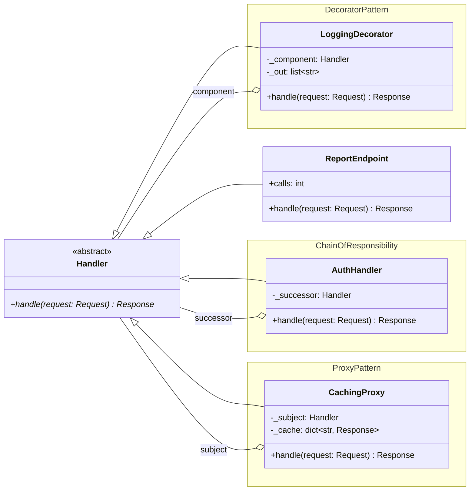
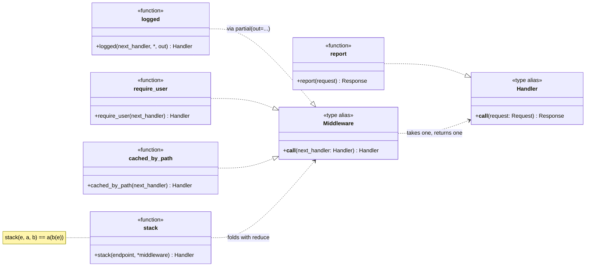
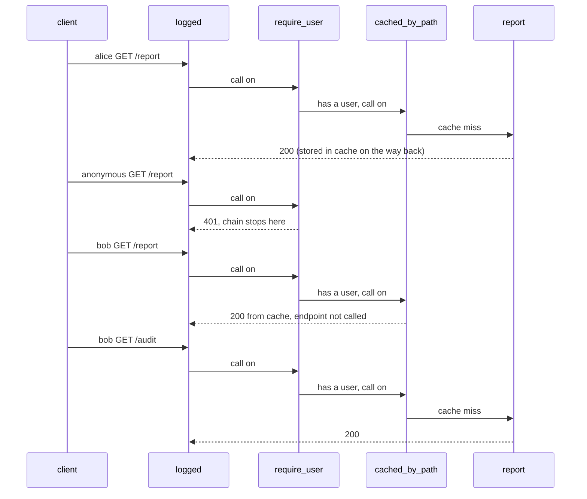

# Middleware: architecture

UML for both shapes of the toy. In the classic diagram, three patterns produce three classes
with an identical outline: each implements `Handler` and holds a `Handler`. The modern diagram
turns that shared outline into one type, `Middleware = Handler -> Handler`.

## Participants

| Pattern | GoF participant | `classic.py` | `modern.py` |
|---|---|---|---|
| Decorator | Component | `Handler` (ABC) | `Handler`, a `Callable` type alias |
| | ConcreteComponent | `ReportEndpoint` | `report`, a nested function in `run()` |
| | ConcreteDecorator | `LoggingDecorator` (holds `_component`) | `logged()` closure (holds `next_handler`) |
| Chain of Responsibility | Handler | `Handler` (ABC) | `Handler` |
| | ConcreteHandler | `AuthHandler` (holds `_successor`) | `require_user()` closure (holds `next_handler`) |
| | Client | `run()` nests the objects | `stack()` folds a list of middleware |
| Proxy | Subject | `Handler` (ABC) | `Handler` |
| | RealSubject | `ReportEndpoint` | `report` |
| | Proxy | `CachingProxy` (holds `_subject`, `_cache`) | `cached_by_path()` closure (holds `next_handler`, `cache`) |

GoF give their Decorator an abstract `Decorator` base class that forwards every call by
default. With only one concrete decorator it would just pass calls through, so `classic.py`
leaves it out.

## Classic: three classes with one outline

Three `o--` arrows go back to `Handler` under three different names. The recursion lives
in that loop back to the base class: any handler can wrap any other.

## Modern: one type, three functions that have it

All three patterns satisfy `Middleware`. In the modern diagram they differ only in name,
which matches the point that they differ only in intent.

## Runtime: four requests through the onion

The classic file runs the same sequence. Replace each participant with its class
(`LoggingDecorator`, `AuthHandler`, `CachingProxy`, `ReportEndpoint`) and each call with
`.handle(request)`.
