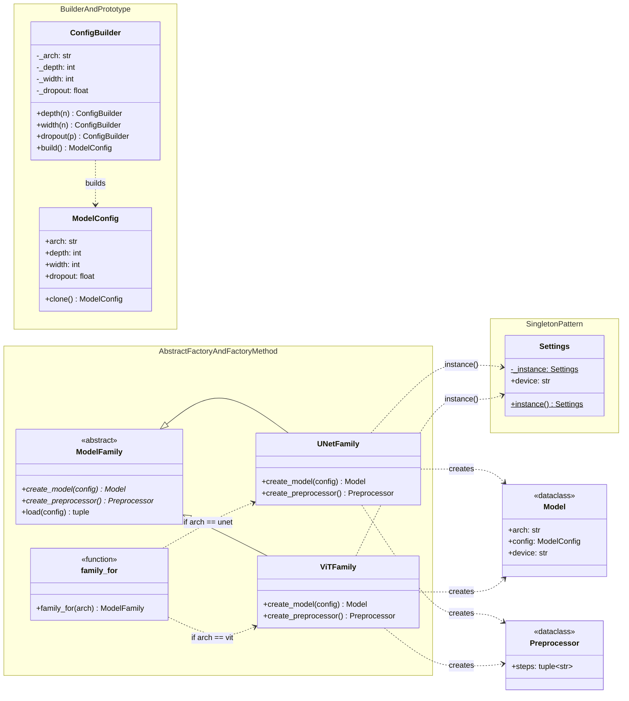
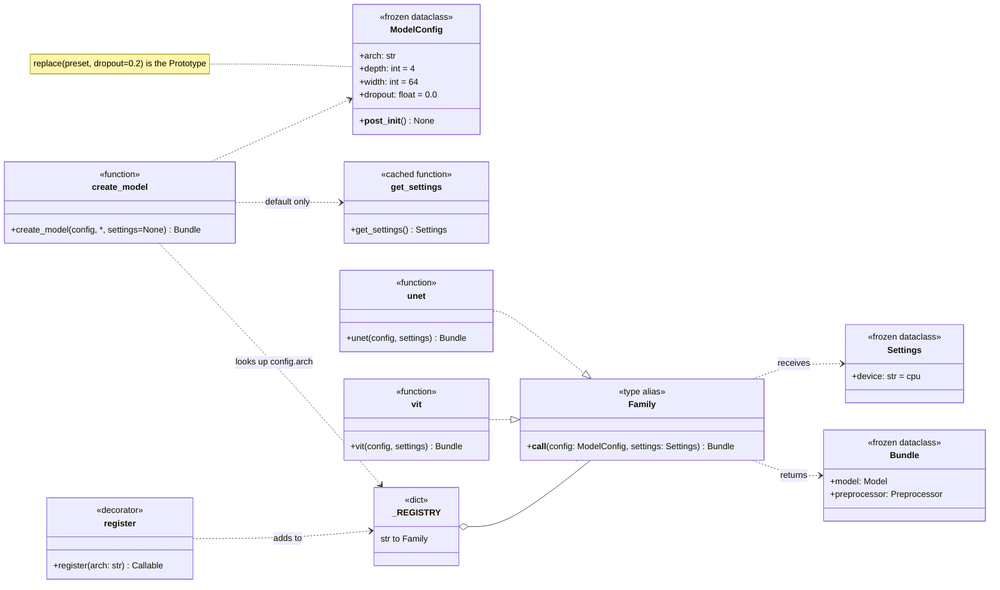
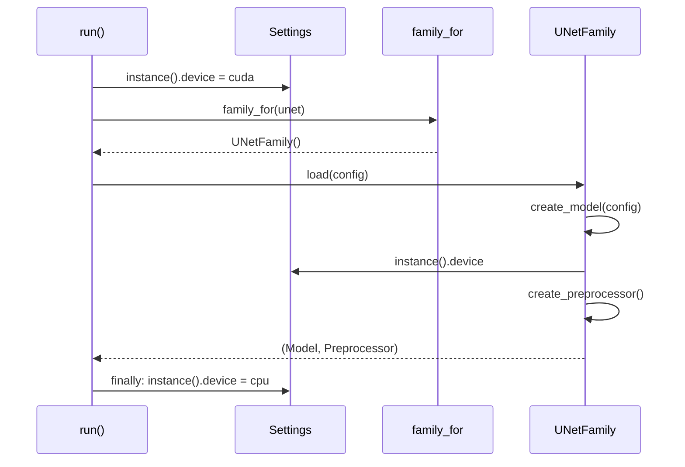
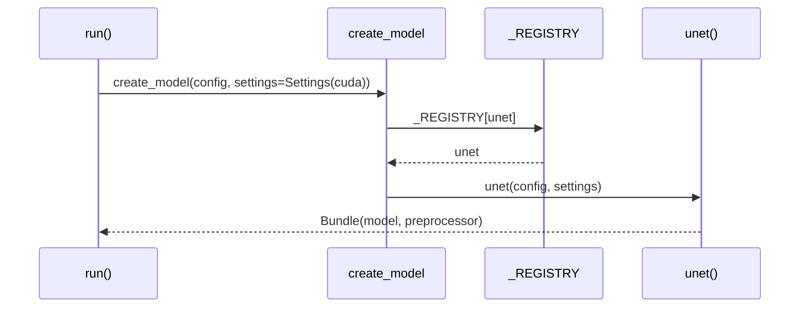

# Model zoo: architecture

UML for both shapes of the toy. Creational patterns are about *who knows which concrete class
to construct*. In the classic shape that knowledge is spread across a builder, a family
hierarchy, an if/elif chooser and a global. In the modern shape it collapses into a frozen
config, a dict, and an argument.

The products (`Model`, `Preprocessor`) are the same plain dataclasses in both files, because
these patterns are about creating them, not about what they are.

## Participants

| Pattern | GoF participant | `classic.py` | `modern.py` |
|---|---|---|---|
| Builder | Builder / ConcreteBuilder | `ConfigBuilder` | the `ModelConfig` constructor: keyword arguments with defaults |
| | Product | `ModelConfig` (mutable) | `ModelConfig` (frozen; `__post_init__` validates) |
| | Director | `PRESETS` definitions, which chain the setters | none needed |
| Prototype | Prototype | `ModelConfig.clone()` | `dataclasses.replace()` |
| | prototype manager | `PRESETS` dict | `PRESETS` dict |
| Abstract Factory | AbstractFactory | `ModelFamily` (ABC) | `Family`, a `Callable` type alias |
| | ConcreteFactory | `UNetFamily`, `ViTFamily` | `unet()`, `vit()` |
| | AbstractProduct / Product | `Model`, `Preprocessor` | `Model`, `Preprocessor`, returned together in `Bundle` |
| Factory Method | Creator | `ModelFamily.load()` calls the abstract `create_*()` | `create_model()` looks up `_REGISTRY` |
| | ConcreteCreator | the overrides in `UNetFamily` / `ViTFamily` | the functions added by `@register("...")` |
| | (choosing a creator) | `family_for()`: if/elif, edited per new arch | `_REGISTRY[config.arch]`: filled by decorators |
| Singleton | Singleton | `Settings.instance()` with `_instance` | `get_settings()` with `@cache`, or the `settings=` argument |

## Classic: a class for each decision

There are two arrows to watch. `family_for` points at *every* concrete family, so adding an
architecture means editing it. Every family points at `Settings` through a static call that
appears in no signature.

## Modern: a registry, a frozen config, and an argument

No arrow points at a specific architecture. `create_model` knows only the registry, and
`Settings` arrives as an argument, with `get_settings()` used only as the default.

## Runtime: creating `unet-small` on cuda

The classic shape has to change a global and then restore it:

The modern shape passes settings in and leaves everything else untouched:

