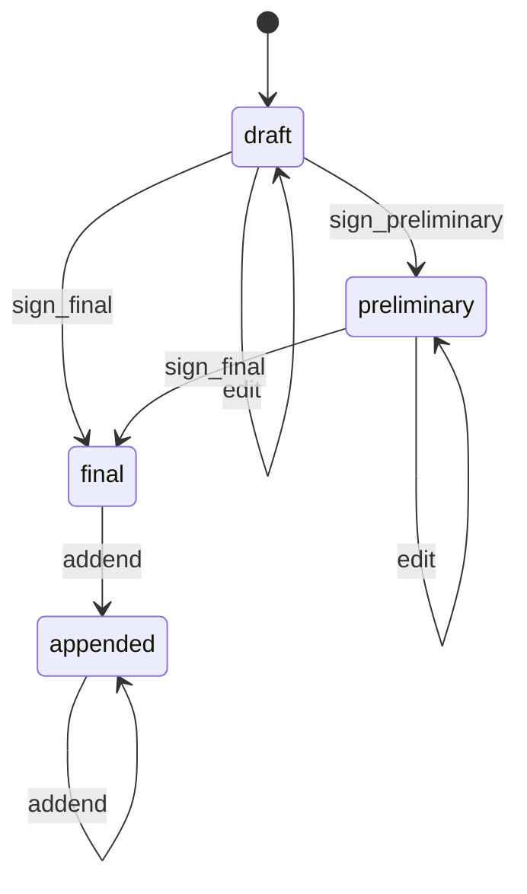
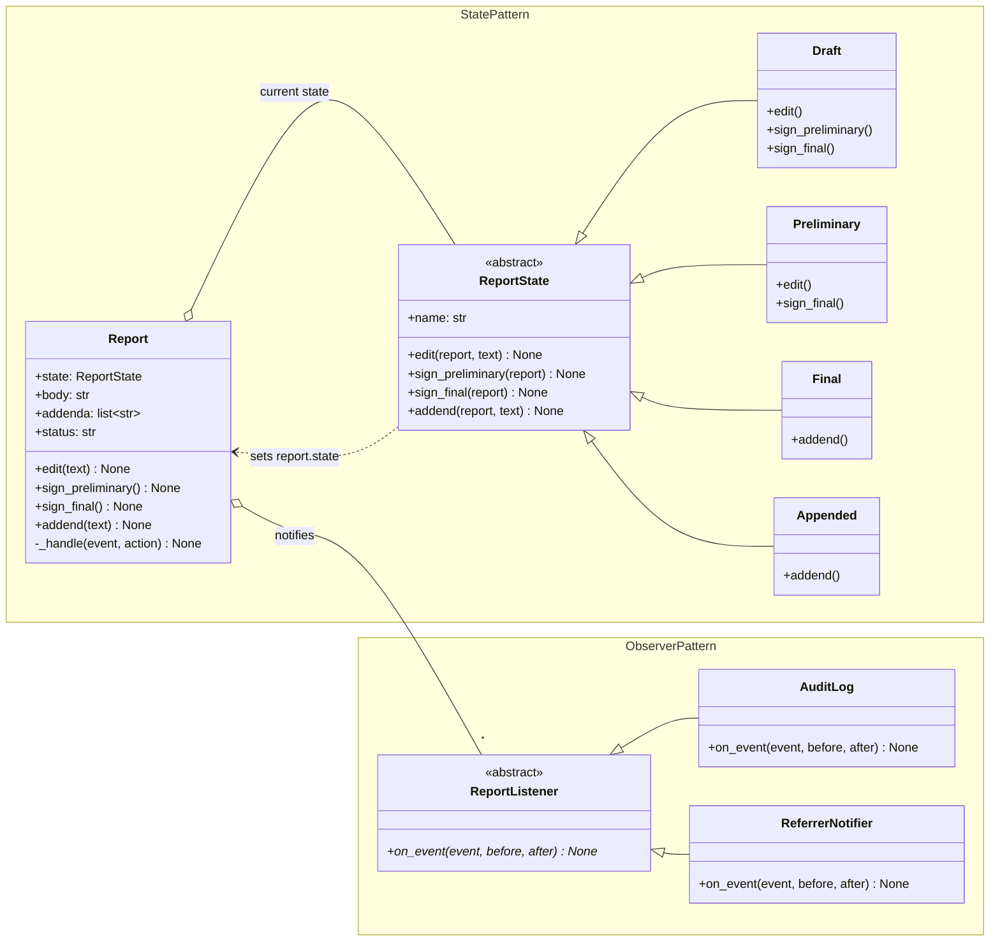
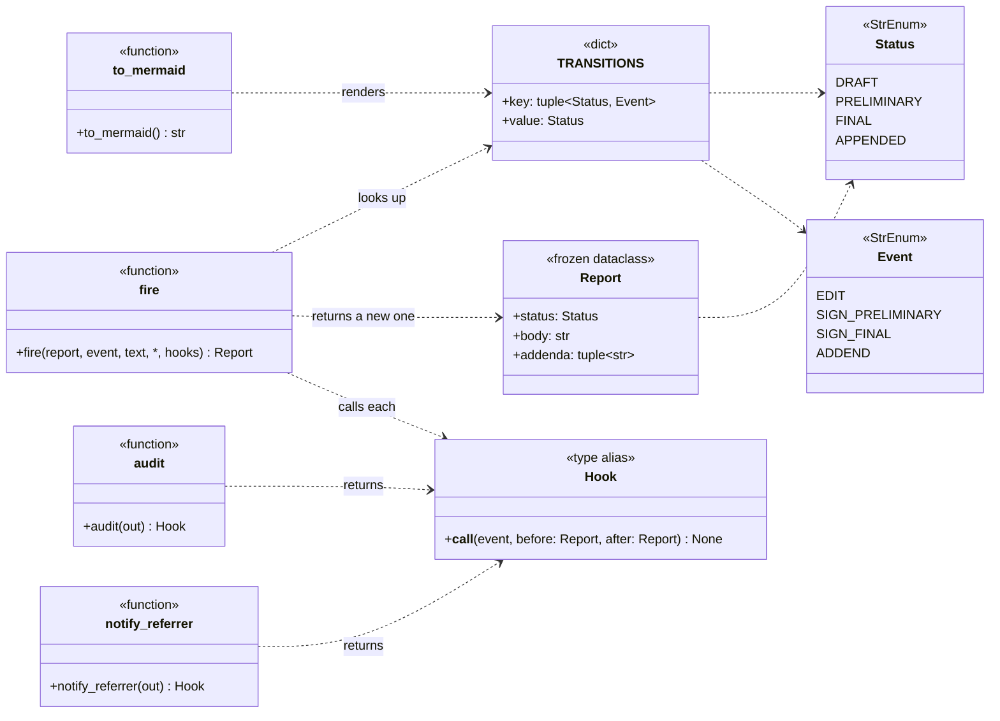
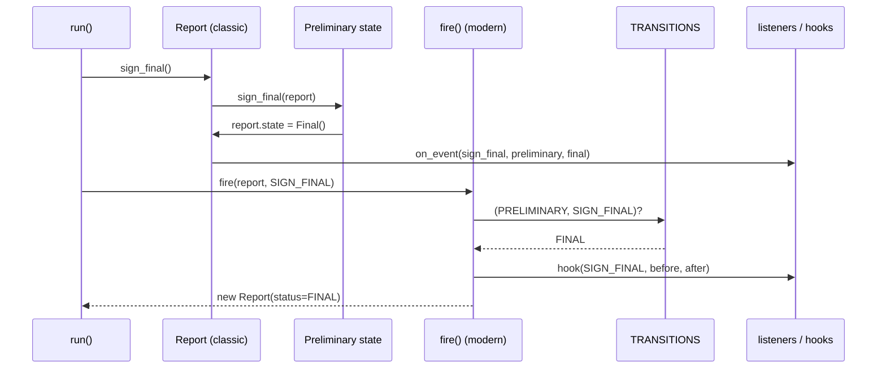

# Report workflow: architecture

UML for both shapes of the toy, plus the state machine itself. In the classic shape that
machine lives in the overridden methods of four classes. In the modern shape it is a
seven-row table, and the diagram below was printed from that table.

## The machine

Generated by `uv run modern.py --diagram` from `TRANSITIONS`. Any event not shown from a
status is rejected.

## Participants

| Pattern | GoF participant | `classic.py` | `modern.py` |
|---|---|---|---|
| State | Context | `Report`: holds `state`, delegates each event to it | `Report`, a frozen record with a `status` field; `fire()` does the delegating |
| | State | `ReportState`: every event raises by default | `Status` (`StrEnum`) |
| | ConcreteState | `Draft`, `Preliminary`, `Final`, `Appended` | the four `Status` members |
| | state-specific behaviour | the methods each subclass overrides | the rows of `TRANSITIONS` for that status |
| | transition | a state assigns `report.state = Next()` | `TRANSITIONS[(status, event)]` |
| Observer | Subject | `Report` (`_listeners`, `_handle()`) | `fire()` (its `hooks=` argument) |
| | Observer | `ReportListener` (ABC) | `Hook`, a `Callable` type alias |
| | ConcreteObserver | `AuditLog`, `ReferrerNotifier` | `audit(out)`, `notify_referrer(out)` closures |

## Classic: the machine spread across classes

**State vs Strategy.** Put this diagram next to
[training-loop's](../training-loop/ARCHITECTURE.md) `Trainer o-- LRSchedule`. The context
holds an interface with several implementations in both. One arrow differs:
`ReportState ..> Report : sets report.state`. A strategy never replaces itself, but a state
does.

## Modern: the machine as a table

Two functions read `TRANSITIONS`: `fire()` *runs* the machine and `to_mermaid()` *draws* it.
That second reader is what you gain by turning the machine into data.

## Runtime: one event, both shapes

