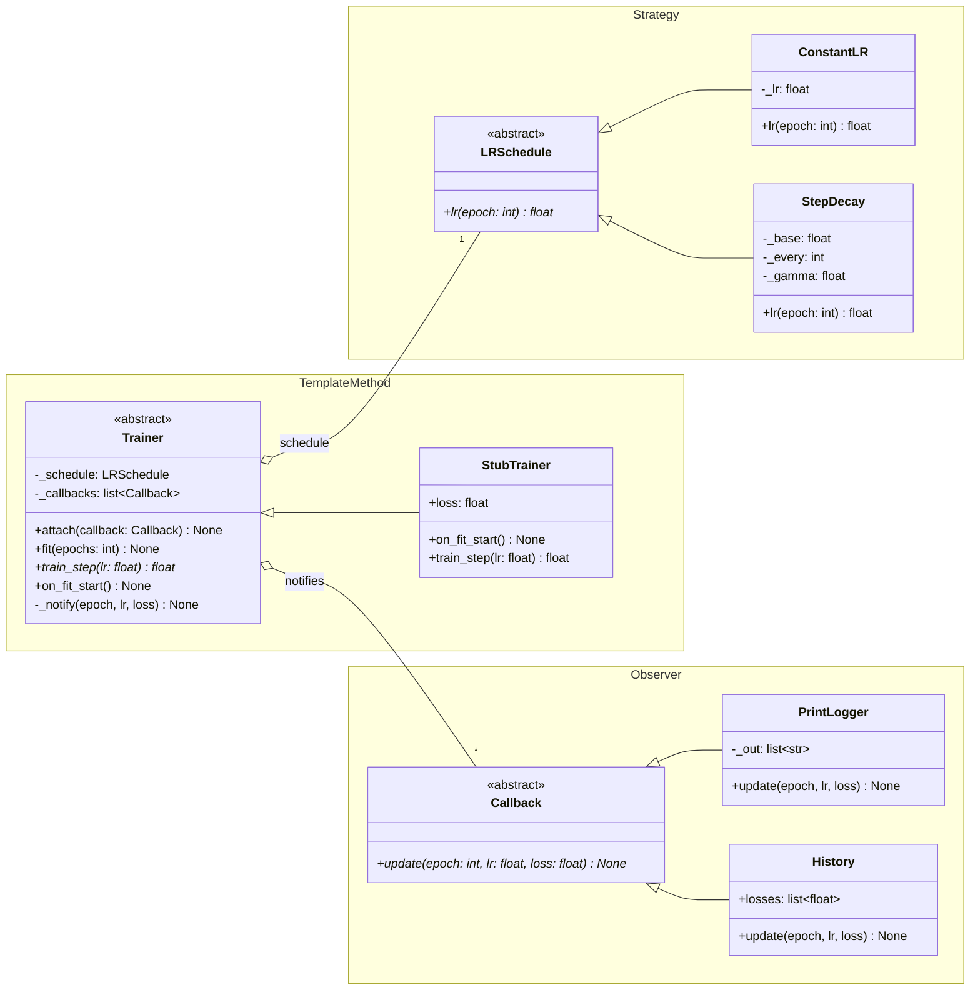
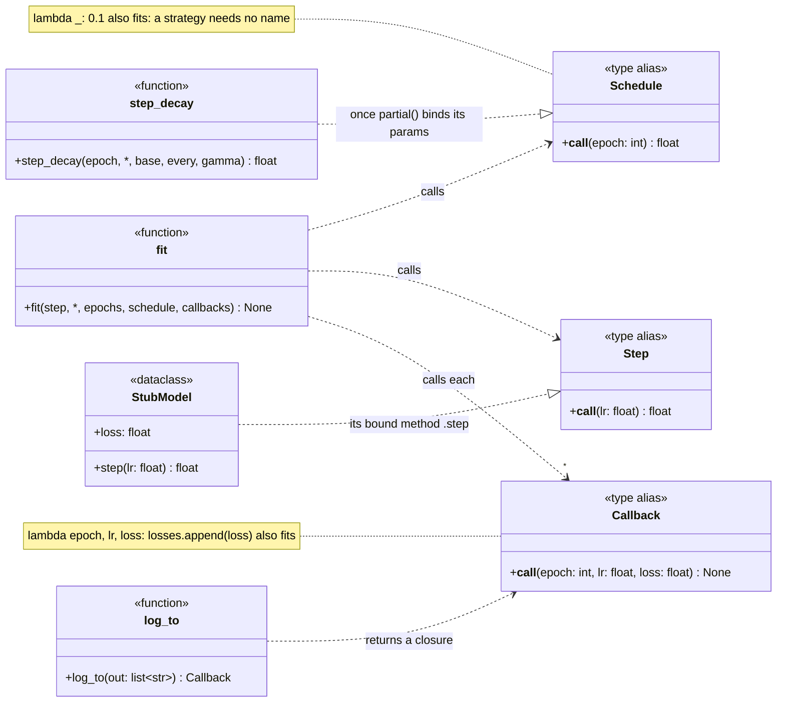
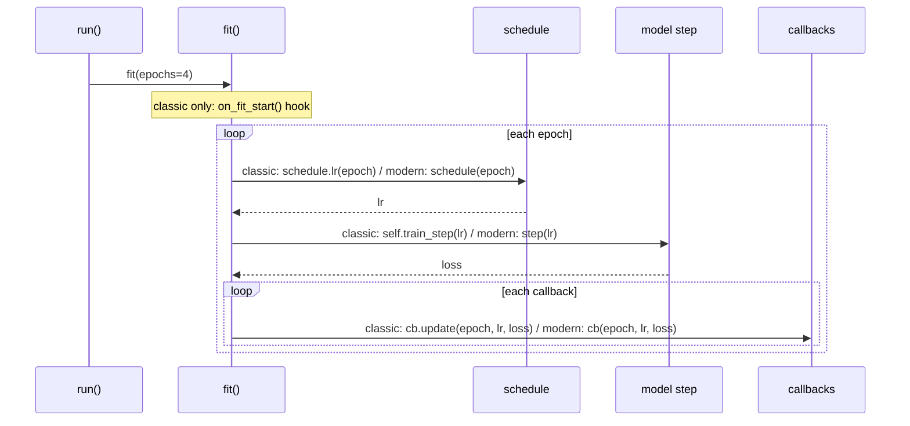

# Training loop: architecture

UML for both shapes of the toy. Both diagrams contain the same roles. What changes is how
those roles are written down.

## Participants

GoF names each role a class plays in a pattern. This table maps each role to the code that
plays it in each shape.

| Pattern | GoF participant | `classic.py` | `modern.py` |
|---|---|---|---|
| Strategy | Strategy | `LRSchedule` (ABC) | `Schedule` (a `Callable` type alias) |
| | ConcreteStrategy | `ConstantLR`, `StepDecay` | `lambda _: 0.1`, `partial(step_decay, ...)` |
| | Context | `Trainer` (holds `_schedule`) | `fit()` (takes `schedule=`) |
| Template Method | AbstractClass | `Trainer` with `fit()` | `fit()` alone: the skeleton is now a function |
| | primitive operation | `train_step()`, abstract | `step`, an argument of type `Step` |
| | hook | `on_fit_start()`, no-op by default | gone: a fresh `StubModel()` starts at loss 1.0 |
| | ConcreteClass | `StubTrainer` | gone: `StubModel` inherits from nothing |
| Observer | Subject | `Trainer` (`attach`, `_notify`) | `fit()`, which loops over `callbacks=` |
| | Observer | `Callback` (ABC) | `Callback` (a `Callable` type alias) |
| | ConcreteObserver | `PrintLogger`, `History` | `log_to(out)` closure, `lambda ...: losses.append(loss)` |

## Classic: one class per role

Each `namespace` box is one pattern. `Trainer` plays two roles. It is the AbstractClass of
Template Method and also the Subject of Observer, so it sits in one box and points into the other.

There are three inheritance trees and eight classes. Every arrow is nominal: a class takes
part only if it names its base class.

## Modern: one type per role, functions fill it

`Callable[[int], float]` amounts to an interface with a single `__call__` method, so the
diagram draws it that way. Inheritance (`<|--`) becomes structural conformance (`..|>`): a
function satisfies the type just by having a matching signature, without naming anything.

All five subclasses are gone. Four were single-method classes that became functions.
`StubTrainer` existed only to supply `train_step()`, and that is now the `step` argument. The
three ABCs became type aliases, which a type checker reads and which do nothing at runtime.

## Runtime: the same loop in both

`fit()` makes the same calls in the same order in both files, which is why `compare.py` can
require identical transcripts.

