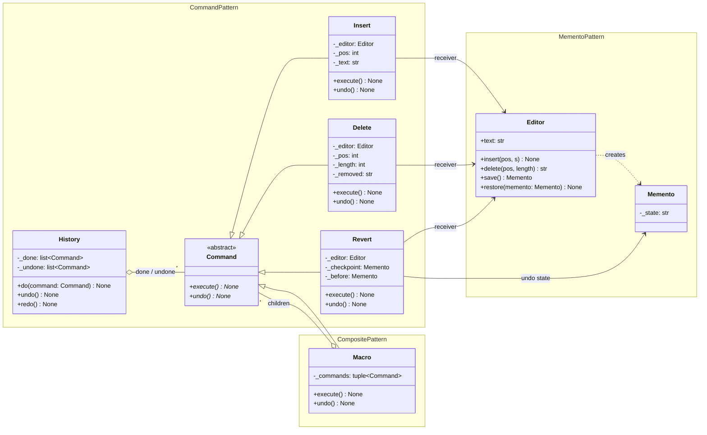
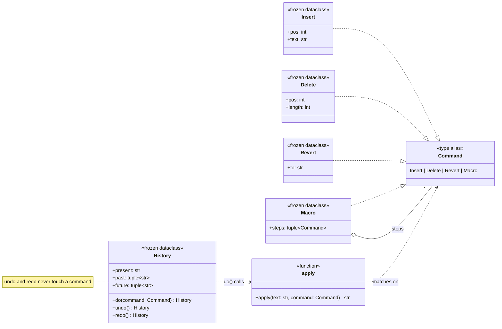
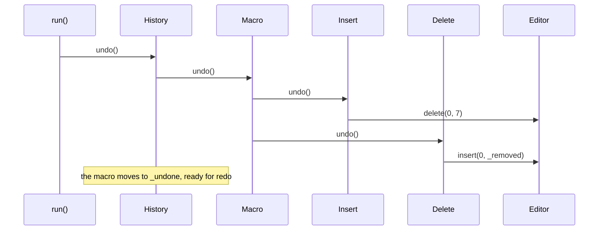
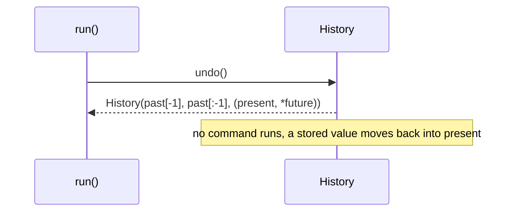

# Undo/redo: architecture

UML for both shapes of the toy. The biggest change is where the knowledge lives. In the
classic shape, each command knows its receiver and its own inverse. In the modern shape,
commands know nothing, one function knows what they mean, and the history holds values
instead of actions.

## Participants

| Pattern | GoF participant | `classic.py` | `modern.py` |
|---|---|---|---|
| Command | Command | `Command` ABC: `execute()`, `undo()` | `Command`: a union of four frozen dataclasses |
| | ConcreteCommand | `Insert`, `Delete`, `Revert`, each holding the `Editor` | `Insert`, `Delete`, `Revert`: fields only |
| | Receiver | `Editor`: `insert()`, `delete()` | `apply(text, command)`: the receiver's logic as one function |
| | Invoker | `History`: `_done` / `_undone` stacks of commands | `History`: `past` / `present` / `future` values |
| | Client | `run()` binds each command to the editor | `run()` builds commands as plain values |
| Memento | Memento | `Memento`, with an opaque `_state` | the previous `str` |
| | Originator | `Editor`: `save()`, `restore()` | none: no object owns mutable state |
| | Caretaker | `run()` (holds `checkpoint`), `Revert` (holds `_before`) | `History.past`, the `checkpoint` variable |
| Composite | Component | `Command` | `Command` |
| | Leaf | `Insert`, `Delete`, `Revert` | `Insert`, `Delete`, `Revert` |
| | Composite | `Macro`: forwards `execute()`, reverses `undo()` | `Macro`, unfolded by `reduce(apply, steps, text)` |

## Classic: commands that carry their receiver and their inverse

Every concrete command points at `Editor`. That arrow is the coupling that makes a classic
command hard to log, send, or replay elsewhere: it isn't a description of an edit, it is an
edit already wired to one object.

## Modern: commands as data, history as values

The arrows to `Editor` are gone, because there is no editor. Only `apply` depends on the
command types. `History` uses `apply` once, in `do()`, and never again.

## Runtime: undoing the macro

Classic undo is a recursive walk that runs every inverse operation in reverse order:

Modern undo makes no call into any command:

